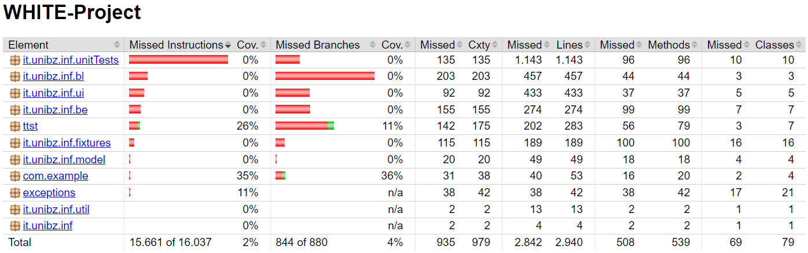

# Auction System
[](/target/site/jacoco/index.html)

# White

- Emanuele Pippa
- Manuel Villotti
- Alessandro Marconi

## Getting started

To make it easy for you to get started with GitLab, here's a list of recommended next steps.

Already a pro? Just edit this README.md and make it your own. Want to make it easy? [Use the template at the bottom](#editing-this-readme)!

## Add your files

- [ ] [Create](https://docs.gitlab.com/ee/user/project/repository/web_editor.html#create-a-file) or [upload](https://docs.gitlab.com/ee/user/project/repository/web_editor.html#upload-a-file) files
- [ ] [Add files using the command line](https://docs.gitlab.com/ee/gitlab-basics/add-file.html#add-a-file-using-the-command-line) or push an existing Git repository with the following command:

```
cd existing_repo
git remote add origin https://gitlab.inf.unibz.it/ttst2324/white.git
git branch -M main
git push -uf origin main
```

## Integrate with your tools

- [ ] [Set up project integrations](https://gitlab.inf.unibz.it/ttst2324/white/-/settings/integrations)

## Collaborate with your team

- [ ] [Invite team members and collaborators](https://docs.gitlab.com/ee/user/project/members/)
- [ ] [Create a new merge request](https://docs.gitlab.com/ee/user/project/merge_requests/creating_merge_requests.html)
- [ ] [Automatically close issues from merge requests](https://docs.gitlab.com/ee/user/project/issues/managing_issues.html#closing-issues-automatically)
- [ ] [Enable merge request approvals](https://docs.gitlab.com/ee/user/project/merge_requests/approvals/)
- [ ] [Set auto-merge](https://docs.gitlab.com/ee/user/project/merge_requests/merge_when_pipeline_succeeds.html)

## Test and Deploy

Use the built-in continuous integration in GitLab.

- [ ] [Get started with GitLab CI/CD](https://docs.gitlab.com/ee/ci/quick_start/index.html)
- [ ] [Analyze your code for known vulnerabilities with Static Application Security Testing (SAST)](https://docs.gitlab.com/ee/user/application_security/sast/)
- [ ] [Deploy to Kubernetes, Amazon EC2, or Amazon ECS using Auto Deploy](https://docs.gitlab.com/ee/topics/autodevops/requirements.html)
- [ ] [Use pull-based deployments for improved Kubernetes management](https://docs.gitlab.com/ee/user/clusters/agent/)
- [ ] [Set up protected environments](https://docs.gitlab.com/ee/ci/environments/protected_environments.html)


# Step 2.b
**Inspect the API documentation of AuctionSystemPublic.jar and compare how a user places a bid with the methods and classes of AuctionSystemPublic.jar and with your orginal code**

## AuctionSystemPublic.jar
*BidUnitTest* is focused on testing the equality of Bid objects, ensuring that the Bid class functions correctly regard its equality logic.

*PlaceBidFixture* provides a structured way to place a bid and verify its success. This class is more relevant to the process of place a bid in the auction system.

## Original Code (White)
*FixtureAddBidTest* and *FixturePlaceBid* classes have methods to set the parameters and validate the results of placing a bid.
They perform validation but do not integrate with an auction system like AuctionManager.

*FixtureAddItemTest* and *FixtureModifyItemTest* classes are related to add and modify items, not directly to place a bid.

# Step 3.b
**Which methods/classes should you consider?**

- *Auction*: It represents an individual auction.
- *Bid*: This class represents a bid made by a user.
- *User:* Represents a user that participate in the auction.

**How do they depend on each other?**

Auction manages the details of individual auctions, including the accepted bids.
Bid represents the bid made by a user.
User interacts with the system by placing bids on auction.

# Discussion of the changes:
We added the TDD using JaCoCo to evaluate how much of the code is executed by the tests.
After that, we obtained a coverage percentage of 98%.

This high coverage percentage of tests means that the biggest part of the code has been tested.
That means we have a good reading of our code, and it's easier to find and solve issues/bugs.
